  
  
  

<b>Cobblemon Rejects: the custom mods and how it runs</b>

 

**Custom mods (Java 21, Fabric)**

- **Sync:** inventory, XP, health, stats and location over MariaDB, gated by the Redis handoff. Around 1,000 lines with JUnit unit and integration tests.
- **Delivery:** hub-store purchases become pending credits that a player redeems on any survival world.
- **Realms:** proxy-side command that routes a player to any backend by name.
- **Vouchers:** economy vouchers on an unforgeable base item. Payouts are treated as untrusted input and clamped.
- **Shop Limits:** a per-player daily sell cap that closes a buy, craft, sell-high exploit loop.
- **Rank features:** per-rank PC boxes, cooldowns and rank badges, all driven by LuckPerms meta.
- **Plus:** a server-side homes menu, a permission-filtered help index, legendary spawn tracking, arena border handling, Reject-form enforcement and quality-of-life commands.

**Operations**

- Docker Compose runs the five backends, the proxy and three datastores as one reproducible stack on a dedicated server.
- Caddy with Authelia TOTP forward-auth in front of every admin panel.
- Nightly encrypted snapshots with an off-site copy, and a restore drill tested end to end.
- World pregeneration, external uptime monitoring and a Discord bot for the community.

